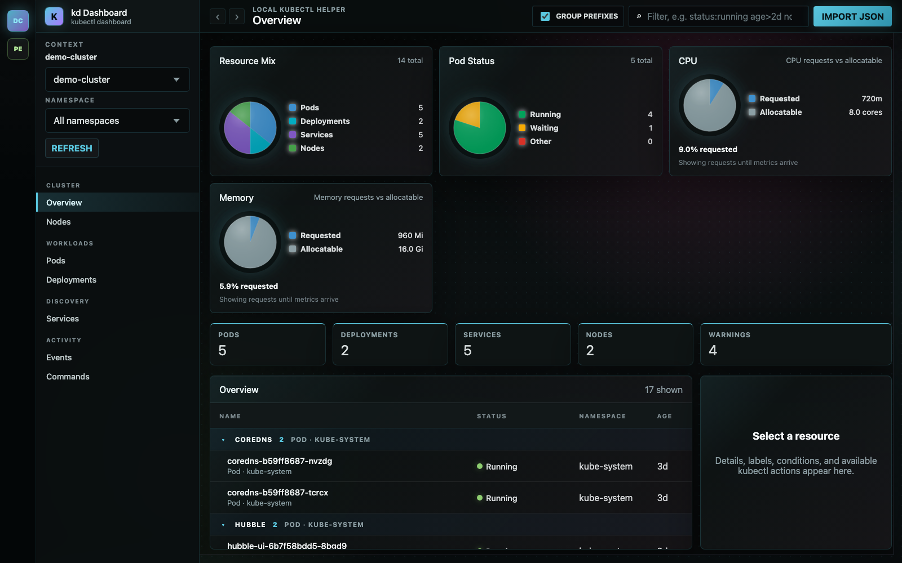
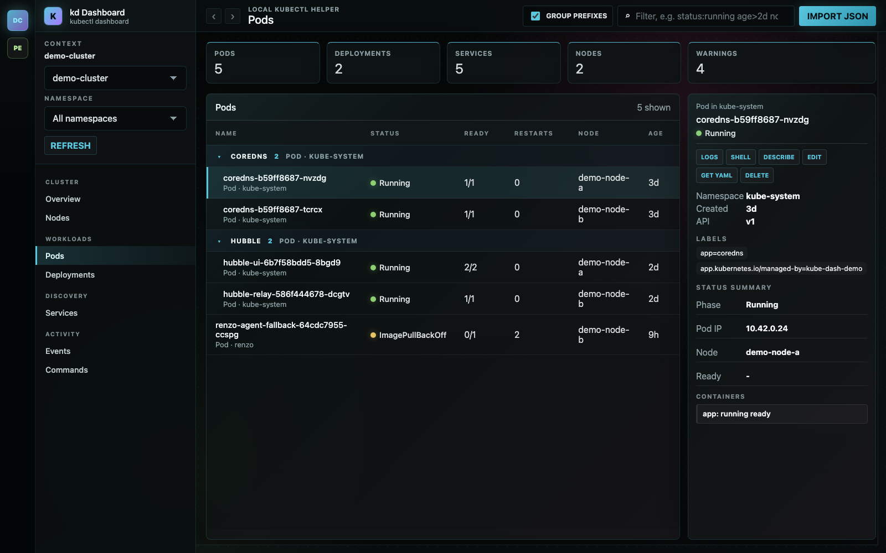

# kube-dash

A local, client-side Kubernetes dashboard powered by your local `kubectl`. It serves a browser UI on localhost and uses your local `kubectl` config to read cluster resources.

## Screenshots





## Quick Install

Install or update `kd` with:

```sh
curl -fsSL https://raw.githubusercontent.com/gm2211/kube-dash/main/install.sh | bash
```

Then run:

```sh
kd
```

The installer clones kube-dash into `~/.kube-dash` and links `kd` into `~/.local/bin`.
If your shell cannot find `kd`, add `~/.local/bin` to your `PATH`.

## Quick Update

Update to the latest `main`:

```sh
curl -fsSL https://raw.githubusercontent.com/gm2211/kube-dash/main/install.sh | bash -s -- --update
```

If you cloned the repo manually, you can also update with:

```sh
cd ~/.kube-dash
git pull --ff-only
```

## Use It

Run:

```sh
kd
```

The dashboard opens at `http://localhost:8765`, discovers your kube contexts, and loads resources from the selected context automatically.

Generated Kubernetes names and natural name families are grouped by shared prefix by default, so related pods, services, and events stay together in the table. Group rows can be collapsed or expanded, and the toolbar toggle persists through the local `kd` helper in `~/.config/kube-dash/preferences.json`, with browser local storage as the fallback when opening the static HTML directly.

The filter box supports plain text plus property filters, including examples like `status:running`, `namespace:kube-system`, `type:service`, `node:default-3nr200`, `age>2d`, `restarts>0`, and label filters such as `app=web` or `label:app=web`.

Other launcher commands:

```sh
kd --serve
kd --port 9000
kd --file
```

If you open `index.html` directly without `kd`, you can still use fallback import mode:

```sh
kubectl get pods,deployments,services,nodes,events -A -o json
```

Paste the JSON into the import panel. The dashboard parses pods, deployments, services, nodes, and events, then generates copyable `kubectl` commands for reads and actions.

## Why commands are copyable

The `kd` helper reads resources and runs dashboard-generated `kubectl` actions locally, using the selected context and namespace.

## Common generated actions

- Pods: logs, exec shell, describe, export YAML, delete
- Deployments: rollout restart, scale, rollout status, describe, export YAML, delete
- Services: port-forward, endpoints, describe, export YAML, delete
- Nodes: cordon, drain, uncordon, describe, export YAML, delete

The Pod Shell action opens an interactive browser terminal through the local `kd` helper. Pod Logs opens a live browser log stream with reconnect and clear controls. Describe opens live `kubectl describe` output in the browser. These actions use the selected context and namespace, and WebSocket actions only accept connections from localhost origins.

The overview includes Kubernetes Dashboard-style pie charts from the loaded resources and CPU/memory time series from `kubectl top`. If metrics-server is unavailable, the metric charts fall back to requests-vs-allocatable data when possible while the resource pies still render.

The Commands view can run dashboard-generated `kubectl` commands directly in the browser. Finite commands return output in a modal, while watch-style commands stream until stopped.

The Edit action fetches live YAML, opens it in a browser editor, and applies it with `kubectl apply -f -` after you enable the Apply button in the modal.
